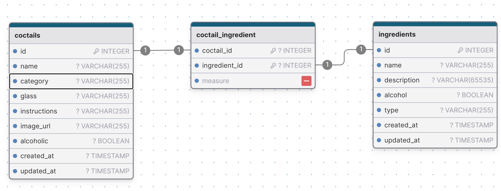

## Backend-cocktail-api


[](https://github.com/Solvro/backend-cocktail-api/actions/workflows/test.yml)


This project is inspired by thecocktaildb API and is used for recruitment tasks at KN Solvro. It provides a public REST API for querying cocktail recipes.

### Data Structure

We store cocktails and their ingredients. Each cocktail can have several ingredients with specified measures.



We have 3 enums stored in app/enums directory:
- CocktailCategory
- CocktailGlass
- IngredientType

### Technologies

This API is built with Node.js using the [Adonis.js framework](https://adonisjs.com/). PostgreSQL is used as the database of choice.

### Documentation

API documentation using Swagger can be found [here](https://cocktails.solvro.pl) and on the main page of the app.

### Installation

Install the main app dependencies:
   ```
   npm install
   ```

Rename `.example.env` to `.env` and configure your environment variables there. At this point you can regenerace app key with `node ace generate:key`.

Migrate the database schema:
   ```
   node ace migration:run
   ```

Seed the database with initial data:
   ```
   node ace db:seed
   ```

### Development

To run the app in development mode:
```
node ace serve
```

The API will be accessible at `http://localhost:3333`.

You can watch live changes by adding --watch or --hmr flag.

### Production

Compile and build the app:
   ```
   node ace build
   ```

The output files will be located in the `build` directory. Expose the `build/public` folder and configure `server.js` as the entry point.

### Testing

Basic tests are be implemented. To run them:
```
node ace test
```

### Scraping

Custom commands were created to gather data from thecocktaildb.

#### Ingredient Synchronization

To synchronize (scrape) ingredients:
Synchronize all ingredients:
  ```
  node ace synchronize:ingredients
  ```
Synchronize one ingredient by ID (e.g., 512):
  ```
  node ace synchronize:ingredients 512
  ```

#### Cocktail Synchronization

To synchronize (scrape) cocktails:
Ensure ingredients are synchronized first.
Synchronize all cocktails:
  ```
  node ace synchronize:cocktails
  ```
Synchronize one cocktail by ID (e.g., 11004):
  ```
  node ace synchronize:cocktails 11004
  ```

### Contributing
Feel free to create an issue or pull request, especially if you have an interesting new cocktail to add.
